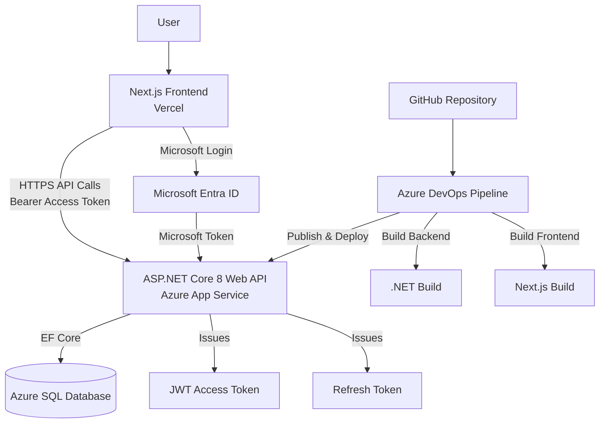

# Inventory Management System (IMS)

A full-stack Inventory Management System built with ASP.NET Core 8, Next.js, Azure SQL, and Azure App Service.

The project demonstrates enterprise-level software development practices including JWT authentication, refresh token rotation, Microsoft OpenID Connect authentication, Azure cloud deployment, and Azure DevOps CI/CD pipelines.

---

## Features

### Authentication & Security

* User Registration
* User Login
* JWT Authentication
* Refresh Token Rotation
* Microsoft OpenID Connect Login
* Role-Based Authorization (Admin/User)

### Inventory Management

* Product Management
* Category Management
* Supplier Management
* Inventory Tracking
* Low Stock Monitoring

### Dashboard & Reporting

* Dashboard Analytics
* Product Count
* Category Count
* Supplier Count
* Low Stock Report

### Cloud & DevOps

* Azure SQL Database
* Azure App Service Deployment
* Azure DevOps CI/CD Pipeline
* Automated Build Validation
* Automated Backend Deployment

---

## Technology Stack

### Backend

* ASP.NET Core 8 Web API
* Entity Framework Core
* SQL Server / Azure SQL
* AutoMapper
* JWT Authentication
* BCrypt Password Hashing
* Repository Pattern
* Service Layer Pattern

### Frontend

* Next.js 15
* React 19
* TypeScript
* Tailwind CSS
* MSAL (Microsoft Authentication Library)

### Cloud

* Azure App Service
* Azure SQL Database
* Microsoft Entra ID (Azure AD)

### DevOps

* GitHub
* Azure DevOps
* YAML Pipelines

---

## Architecture

The application follows a layered architecture:

Controller
→ Service
→ Repository
→ Entity Framework Core
→ Azure SQL Database

Key design patterns:

* Repository Pattern
* Service Layer Pattern
* DTO Pattern
* Dependency Injection
* AutoMapper

## Architecture Diagram

## Authentication Flow

### Traditional Login

Email + Password
↓
Auth Service
↓
JWT Access Token
↓
Refresh Token
↓
Protected APIs

### Microsoft Login

Microsoft Entra ID
↓
Microsoft Access Token
↓
IMS User Mapping
↓
IMS JWT Token
↓
Protected APIs

---

## CI/CD Pipeline

GitHub
↓
Azure DevOps Pipeline
↓
Restore Packages
↓
Build Backend
↓
Build Frontend
↓
Publish Backend
↓
Deploy Azure App Service

---

## Deployment

### Backend

Azure App Service

### Database

Azure SQL Database

### Frontend

Vercel

---

## Future Improvements

* Unit Testing with xUnit
* Clean Architecture
* Docker Containerization
* Redis Caching
* CQRS & MediatR
* Integration Testing

---

## Author

Stephan Xi

Software Developer | .NET | React | Azure
